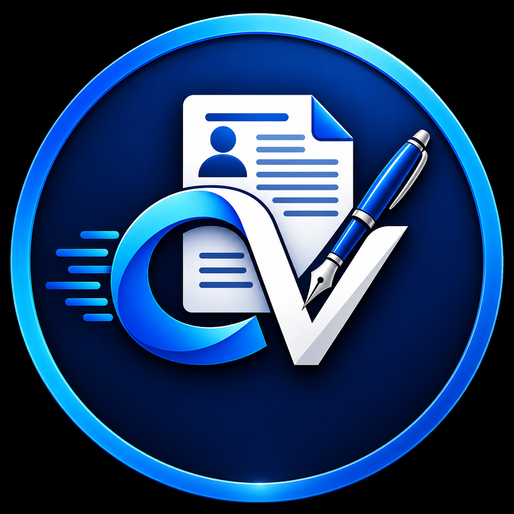

<div align="center">

  

  # CVCraft
  ### 📄 Professional Resume Architect & Multi-Document Engine

  <p>
    <strong>Craft industrial-grade, ATS-compliant multi-page resumes and seamlessly merge certificates in your browser.</strong>
  </p>

  <p>
    <a href="#-features">Features</a> •
    <a href="#-getting-started">Getting Started</a> •
    <a href="#-architecture">Architecture</a> •
    <a href="#-author">Author</a>
  </p>

  <p>
    
    
    
    
  </p>

</div>

---

## ✨ Features

* 📐 **Universal A4 Multi-Page Layout**: True 1:1 print-accurate geometry with exact margin preservation and page break control.
* 🧙 **Comprehensive 6-Step Profile Wizard**: Guided identity, qualifications, structured work history, technical competencies, personal data, and passport management.
* 📑 **Certificate & Document Merging**: Attach trade certificates, diplomas, passport scans, and multi-page PDFs to download everything into a single master PDF.
* 🔖 **5-Slot Preset Switcher**: Quickly switch between 5 customized job profiles (e.g. *Piping Foreman*, *Structural Fabricator*, *Fitter*).
* 🔒 **100% Client-Side Privacy**: All data is stored locally in your browser's IndexedDB and localStorage. No accounts, no servers, zero telemetry.
* 📦 **Full-Fidelity JSON Backups**: Drag-and-drop instant state export and restore with lossless document replication.
* 📱 **Separated Mobile Experience**: Adaptive touch zoom, distraction-free editing mode, and drawer navigation.

---

## 🖥️ Live Architecture & Structure

| File | Description |
| :--- | :--- |
| **[`index.html`](index.html)** | Flagship landing page with feature showcase, workflow guide, and intelligent session routing. |
| **[`CVCraft.html`](CVCraft.html)** | Interactive live A4 builder, preset manager, document merger, and high-DPI vector PDF exporter. |
| **[`logo.png`](logo.png)** | High-resolution brand vector emblem. |
| **[`favicon.png`](favicon.png)** | Browser tab icon. |

---

## 🚀 Getting Started

CVCraft requires **no build tools**, **no npm dependencies**, and **no server setup**.

### Option 1: Direct Browser Launch
1. Clone this repository:
   ```bash
   git clone https://github.com/janakirao966/cvcraft.git
   ```
2. Double click **`index.html`** or **`CVCraft.html`** in any modern web browser (Chrome, Edge, Firefox, Safari).

### Option 2: Deploy to GitHub Pages
1. Go to your repository **Settings** → **Pages**.
2. Under **Build and deployment**, select **Deploy from a branch** → Branch: `main` / `root`.
3. Your CVCraft application is instantly live online!

---

## 🛠️ Technology Stack

* **Core**: Vanilla HTML5, CSS3, ES6+ JavaScript
* **PDF Rendering**: html2canvas & pdf-lib
* **PDF Preview & Extraction**: PDF.js
* **Storage Engine**: Browser-native IndexedDB & LocalStorage
* **Typography**: Clean Arial / Helvetica typography + Outfit brand typography
* **Icons**: Lucide Vector Icons

---

<div align="center">

  Developed with ❤️ by **Janakirao**

  <sub>CVCraft &bull; Professional Resume Architect</sub>

</div>
